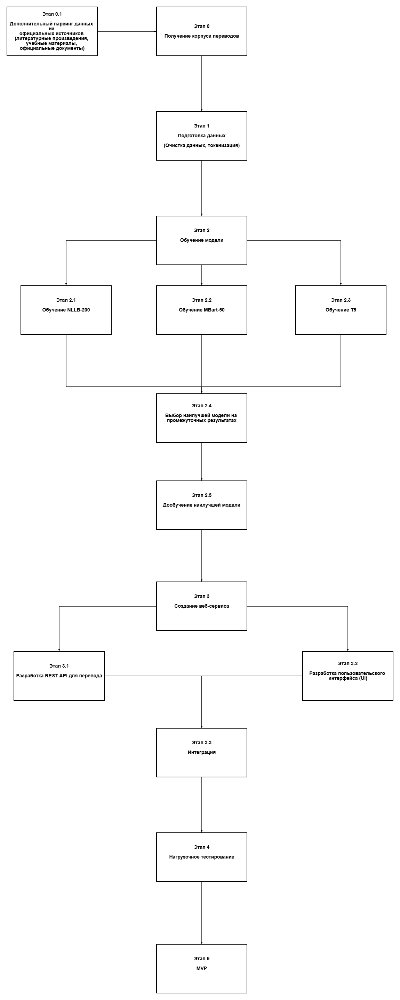

# ML System Design Doc - [RU]
## Дизайн ML системы - Машинный перевод с русского на мансийский язык (MVP, Итерация 1)

*Шаблон ML System Design Doc от телеграм-канала [Reliable ML](https://t.me/reliable_ml)*   

- Рекомендации по процессу заполнения документа (workflow) - [здесь](https://github.com/IrinaGoloshchapova/ml_system_design_doc_ru/blob/main/ML_System_Design_Doc_Workflow.md).  
- Детальный доклад о том, что такое ML System Design Doc и о том, как, когда и зачем его составлять - [тут](https://www.youtube.com/watch?v=PW9TGNr1Vqk).
    
> ## Термины и пояснения
> - Итерация - это все работы, которые совершаются до старта очередного пилота  
> - БТ - бизнес-требования 
> - EDA - Exploratory Data Analysis - исследовательский анализ данных  
> - `Product Owner`,  `Data Scientist` - роли, которые заполняют соответствующие разделы 
> - В этом шаблоне роль `Data Scientist` совмещает в себе компетенции классического `Data Scientist` с упором на исследования и `ML Engineer` & `ML Ops` роли с акцентом на продуктивизацию моделей
> - Для вашей организации распределение ролей может быть уточнено в зависимости от операционной модели 

### 1. Цели и предпосылки 
#### 1.1. Зачем идем в разработку продукта?  

- Бизнес-цель
  
    Целью проекта является создание доступного и эффективного инструмента для машинного перевода с русского языка на мансийский и обратно с использованием современных технологий машинного обучения.

- Почему станет лучше, чем сейчас, от использования ML

    Мансийский язык, как и многие другие языки коренных народов, находится под угрозой исчезновения. Машинный перевод может сыграть важную роль в сохранении этого языка, улучшении доступности информации на нем и популяризации среди новых поколений. С помощью машинного перевода можно будет переводить различные образовательные материалы, литературу и другие ресурсы с русского на мансийский, что значительно расширит доступность информации для носителей языка и повысит интерес к изучению языка.

- Что будем считать успехом итерации с точки зрения бизнеса
  - Функциональность API:
    - API должно быть развернуто и доступно для работы через REST-запросы.
    - API предоставляет перевод текста с русского на мансийский и обратно.
  - Быстродействие API:
    - Среднее время отклика: Перевод одной строки текста (длиной до 100 символов) выполняется за менее чем 1 секунду в 95% случаев.
    - Гарантированное время отклика (SLA): Время ответа API не превышает 2 секунд даже при максимальной нагрузке.
  - BLEU (Bilingual Evaluation Understudy):
    - Целевой показатель для базовой модели составляет 20–30% для первых итераций.
    - Сравнение модели с репрезентативным тестовым набором из параллельных предложений.
  - Удовлетворенность пользователей (реальные отзывы):
    - Минимум 80% положительных отзывов от тестовых пользователей на этапе пилота.
  - Пользовательский опыт (UX):
    - Время загрузки веб-интерфейса: Меньше 2 секунд.
    - Интуитивно понятный интерфейс для работы с API и перевода текста.

#### 1.2. Бизнес-требования и ограничения  

- Краткое описание БТ и ссылки на детальные документы с бизнес-требованиями

    Веб-сервис должен предоставить интуитивно понятный интерфейс для пользователей, позволяя переводить текст в режиме онлайн с русского на мансийский и наоборот.
  
- Бизнес-ограничения
  - Ограниченный объем обучающих данных для мансийского языка.
  - Сроки на реализацию итерации: 3 месяца.
  - Ограниченный бюджет на инфраструктуру.
    
- Что мы ожидаем от конкретной итерации
  - Первая версия модели с базовым качеством перевода, оптимизированная под реальное использование.
  - Базовая версия пользовательского интерфейса (веб-сервис).
- Описание бизнес-процесса пилота, насколько это возможно - как именно мы будем использовать модель в существующем бизнес-процессе?

    Пользователи вводят текст на русском или мансийском в веб-интерфейсе и получают перевод на целевой язык. В пилоте используется базовая Seq2Seq модель, обученная на корпусе мансийского языка и развернутая через API.
  
- Что считаем успешным пилотом? Критерии успеха и возможные пути развития проекта
  - Веб-сервис успешно обрабатывает запросы в реальном времени.
  - BLEU-оценка для перевода соответствует запланированным метрикам.
  - Получены положительные отзывы от пользователей (минимум 80% удовлетворенности).

#### 1.3. Что входит в скоуп проекта/итерации, что не входит   

- На закрытие каких БТ подписываемся в данной итерации
  - Разработка и развертывание базовой модели машинного перевода для русского и мансийского языков.
  - Создание API для работы с переводчиком.
  - Подготовка минимального набора данных для обучения и тестирования модели.   
- Что не будет закрыто
  - Интеграция с внешними платформами.
  - Оптимизация модели для перевода длинных текстов.
- Описание результата с точки зрения качества кода и воспроизводимости решения
  Код будет полностью задокументирован и протестирован. Решение должно быть воспроизводимым для дальнейшего улучшения.  
- Описание планируемого технического долга (что оставляем для дальнейшей продуктивизации)
  - Оптимизация модели для работы с большими текстовыми массивами.
  - Добавление системы логирования запросов и их обработки.
  - Внедрение переводчика в популярные онлайн-переводчики.

#### 1.4. Предпосылки решения  

- Описание всех общих предпосылок решения, используемых в системе – с обоснованием от запроса бизнеса: какие блоки данных используем, горизонт прогноза, гранулярность модели, и др.
  - Данные: используем корпус параллельных текстов на русском и мансийском языках. Это могут быть литературные произведения, учебные материалы и официальные документы. Однако, для достижения необходимого объема данных, будут предприняты дополнительные шаги:
    - Предобработка текста. На этапе подготовки данные будут очищены от ошибок, некорректных символов, дубликатов и пустых строк. Также будет проведена токенизация текста (разбиение на слова и предложения) и нормализация (приведение текста к единому виду). Эти меры необходимы для повышения качества обучающего корпуса.
    - Дополнение корпуса. Планируется расширить корпус данных с помощью парсинга открытых источников, таких как электронные библиотеки, учебные материалы, государственные сайты и официальные документы. Автоматизированный сбор данных позволит дополнить корпус новыми текстовыми парами, соответствующими тематике проекта.
  - Модель: базируемся на Seq2Seq-модели из библиотеки transformers. Seq2Seq подход предоставляет удобную архитектуру для обучения как на больших, так и на малых объемах данных. Базовые Seq2Seq модели легко настраиваются, поддерживают дообучение на специфических языках и предоставляют хорошие результаты для пар языков с разной структурой. Он поддерживает использование предобученных моделей, что позволяет сократить потребность в данных. Для базовой версии выбирается уже предобученная модель, дообученная на собранном корпусе данных. 
  - Горизонт прогноза: Перевод отдельных предложений или коротких абзацев текста.
  - Гранулярность: Уровень перевода — предложение или абзац, ориентированный на точность синтаксического и семантического соответствия.

### 2. Методология `Data Scientist`     

#### 2.1. Постановка задачи  

- С технической точки зрения задача формулируется как:
  - Построение системы машинного перевода на основе Seq2Seq-модели.
  - Разработка и развертывание REST API для перевода текстов.
  - Построение пайплайна, включающего:
    - Предобработку данных.
    - Обучение модели на парных данных (русский-мансийский).
    - Постобработку результата перевода.

#### 2.2. Блок-схема решения  
- 
    - Этап 0: Получение корпуса переводов
      - Цель этапа – собрать и подготовить корпус текстов на русском и мансийском языках, чтобы обучить модель машинного перевода. Дополнительный парсинг данных из официальных источников, включая: литературные произведения (на обоих языках). учебные материалы (словари, пособия, справочники), официальные документы (юридические, государственные).
    - Этап 1: Подготовка данных
      - На этом этапе происходит обработка корпуса переводов для их последующего использования в обучении, например, удаление лишних символов, ошибок, пустых строк.
    - Этап 2: Обучение модели
      - Этап направлен на создание и настройку моделей машинного перевода. Обучение проводится на нескольких архитектурах для выбора наилучшего решения. Результаты промежуточного обучения каждой модели сравниваются по ключевым метрикам: BLEU. Выбирается модель с наилучшим качеством перевода. Выбранная модель дообучается на более редких и сложных примерах, чтобы улучшить качество перевода специфических конструкций.
    - Этап 3: Создание веб-сервиса
      - Цель этапа – разработать функциональный веб-сервис для использования обученной модели перевода: REST API и UI с последующим объединением в единый продукт.
    - Этап 4: Нагрузочное тестирование
      - На этом этапе проводится тестирование веб-сервиса под различными нагрузками. Проверяются сценарии: обработка большого числа запросов одновременно, работа с текстами разных объёмов (короткие, длинные),корректность перевода при нестандартных данных (например, смешении языков).
    - Этап 5: MVP (Минимально жизнеспособный продукт)
      - Заключительный этап, на котором создаётся функциональный продукт, готовый для тестового использования:

#### 2.3. Этапы решения задачи `Data Scientist`  
#### *Этап 0 - EDA*  

1. Цель анализа  
EDA проводится для оценки состава, объема и качества данных, а также для выявления потенциальных проблем, которые могут повлиять на обучение модели. Используемый датасет содержит параллельные тексты на русском и мансийском языках.
2. Описание данных
Датасет: overall_80K.csv:
   - Количество строк: 81146
   - Колонки:
     - Unnamed: 0 — служебный индекс (удален на этапе предобработки).
     - source — текст на русском языке.
     - target — текст на мансийском языке.

3. Предобработка данных:
   - Удаление строк с одинаковыми текстами.
   - Токенизация и очистка текста.
   - Для русского языка необходимо дальнейшее улучшение качества данных (например, удаление записей с низким качеством).
- [Оригинальный датасет](../notebooks/EDA/overall_80K.csv)
- [Предобработанный датасет](../notebooks/EDA/overall_80K_corrected.csv)
- [Ноутбук](../notebooks/EDA/correcting_dataset.ipynb)   

#### *Этап 1 - Подготовка данных*  
1. Данные и сущности, на которых будет обучаться  модель машинного обучения  
  
| Название данных  | Есть ли данные в компании (если да, название источника/витрин) | Требуемый ресурс для получения данных (какие роли нужны) | Проверено ли качество данных (да, нет) |
| ------------- | ------------- | ------------- | ------------- |
| Параллельные тексты на русском и мансийском | Да (корпус overall_80K)  | DE/DS | + |
| Данные, полученные с помощью скрейпинга  | Нет (собраны дополнительно)  | DE/DS	 | + |
| Слова и выражения из мансийского словаря | Нет (скрейпинг словаря)  | DE/DS	 | + |
 
2. Описание данных, состав, объем и качество
   - Первичный датасет:
     - Исходный объем: 81146 строк × 3 столбца (Unnamed: 0, source, target).
     - Обработанный объем: 79958 строк × 2 столбца (source, target).
   - Проблемы:
     - Удалены строки с одинаковыми текстами на русском и мансийском языках (source == target), которые не добавляют ценности для обучения. Это сократило объем данных, но повысило их релевантность.
     - В текстах на русском языке выявлены "шумные" слова (плохая разборчивость с помощью морфологического анализатора).
   - Дополнения к выборке:
     - Скрапинг словаря (Афанасьева К.В., Собянина С.А.):
       - Добавлены дополнительные пары слов (мансийский-русский).
       - Эти данные увеличили объем корпуса и охват тематик, представленных в тексте.
    - Скрапинг материалов:
      - Увеличили количество записей, ориентированных на сложные синтаксические конструкции.
        
3. Данные и сущности, на которых будет обучаться  модель машинного обучения
   - Объем данных:
     - Несмотря на все предпринятые меры (скрейпинг, дополнение из словарей), объем данных остается ограниченным. Это связано с малым количеством текстов на мансийском языке в открытых источниках.
     - Риск: Невозможность обеспечить высокое качество перевода из-за нехватки данных
   - Качество данных:
     - В первичном корпусе значительных проблем с качеством не выявлено. Однако тексты на русском языке иногда включают шум, что может повлиять на обучение модели.
   - Неравномерность распределения данных:
     - Возможно, определенные темы и лексические структуры представлены слабо. Это может привести к ухудшению качества перевода в специфических областях.

4. Описание процесса генерации данных
   - Источники данных:
     - Основной корпус: параллельные тексты (литература, официальные документы, учебные материалы).
     - Скрапинг: мансийско-русский словарь, доступные материалы из интернета.
   - Формат данных:
     - Данные хранятся в виде CSV файлов с двумя колонками (source, target), где source — текст на русском языке, а target — текст на мансийском языке.
   - Процесс генерации:
     - Скрапинг данных из доступных источников (например, словари, литература).
     - Предобработка текстов: очистка от пунктуации, токенизация, проверка на корректность словоформ.
     - Обогащение данных через аугментацию (перестановка слов, изменение словоформ для увеличения объема данных).
  - Регулярность процесса:
    - Однократный сбор данных для текущего этапа. Возможно, в будущем потребуется дополнительный сбор данных, если объем окажется недостаточным.
      
5. Решение проблемы нехватки данных
   - Использование техники Transfer Learning:
     - Обучение модели на предобученных языковых моделях (например, NLLB-200 или mBART), которые уже имеют базовые знания о других языках.
   - Требуемый объем данных:
     - Для достижения приемлемого качества BLEU на уровне 20-30% потребуется около 100–150 тысяч пар предложений. Однако текущий объем данных (~80 тыс.) является максимальным, который можно собрать в рамках данной итерации.
       
6. Конфиденциальность данных
   - В текущем корпусе конфиденциальная информация отсутствует (источники — общедоступные материалы и словари).
   - Проверять все будущие дополнения к корпусу на наличие персональных данных или конфиденциальной информации.

7. Необходимый результат этапа
   - Обновленный корпус данных (overall_80K_corrected.csv).
   - Оценка состава данных и качества
   - Подготовленный процесс регулярной обработки данных
       
#### *Этап 2 - Подготовка прогнозных моделей*  
1. Выбранные метрики:
   - BLEU (Bilingual Evaluation Understudy):
     - Используется для оценки качества перевода текста, сравнивая переведенный текст с эталонным.
     - BLEU хорошо подходит для измерения точности перевода, так как оценивает совпадение n-грамм (на уровне слов и фраз) между предсказанным и референсным переводами. Для нашей задачи это ключевой критерий качества.
   - ROUGE (Recall-Oriented Understudy for Gisting Evaluation):
     - Оценивает полноту перевода, сравнивая пересечение n-грамм с референсным текстом.
     - ROUGE полезен для проверки, насколько полон перевод, что особенно важно при работе с редкими языками, где каждое слово может нести критическое значение.
2. Выбранная функция потерь:
   - Cross-Entropy Loss:
     - Используется для Seq2Seq-моделей.
     - Позволяет оптимизировать вероятность предсказания правильной последовательности токенов. Хорошо работает для задач генерации текста.

3. Описание схемы ML-валидации
   - Модель:
     - 80% данных на обучение.
     - 10% данных на валидацию.
     - 10% данных на тестирование.
     - Убедиться, что редкие конструкции равномерно распределены между train/val/test.
     - Баланс между количеством данных для обучения и проверки качества. Учитываем ограниченность данных.

4. Описание структуры бейзлайна
   - Разделение данных:
     - Модель 1: mBART
     - Модель 2: NLLB-200
     - Модель 3: T-50
  - Предобработка:
    - Удаление пунктуации, токенизация, нормализация.
    - Замена редких слов <UNK> токеном.
    - Удаление дублирующихся или неинформативных строк.
  - Процесс моделирования:
    - Обучение бейзлайна (Seq2Seq) на корпусе.
    - Оценка BLEU и ROUGE на валидационном наборе.
    - Дообучение лучшей модели.

5. Стратегии дальнейшего развития решения
   - Оптимизация гиперпараметров:
     - Bayesian Optimization для выбора оптимального learning rate, batch size и других параметров.
   - Data Augmentation:
     - Перевод текста через третий язык (back-translation).
     - Перестановка предложений и добавление шумов.
     
6. Анализ и интерпретация работы модели
   - Оценка качества:
     - Использование BLEU для общих текстов и ручной проверки для редких слов.
     - Сравнение перевода модели с эталонными переводами.
   - Интерпретация ошибок:
     - Анализ ошибок, допущенных моделью (например, грамматические ошибки, неправильные окончания).
     - Выявление паттернов ошибок (частотность, категории слов).
   - Влияние дополнительных данных:
     - Проверка, как добавление новых данных (например, словарей) улучшает BLEU/ROUGE.

7. Риски данного этапа и способы их снижения  

|  Риск 	|   Способ снижения 	|
|---	|---	|
|   Плохое качество перевода из-за редких слов  	|   Использование подкорпуса словаря и POS-тегов, фокус на редкие слова	|
|   Неправильное разбиение данных, что ведет к смещению модели	|   Стратификация данных перед разбиением, проведение нескольких тестов на разных подвыборках.	|
|  Перегрузка модели при обучении 	|  Мониторинг метрик валидации, использование ранней остановки (Early Stopping). 	|

8.Необходимый результат этап
- Дообученная лучшая по показателям Seq2Seq-модель, продемонстрировавшая базовые показатели BLEU (>20%)
- Анализ ошибок и выявление зон для улучшения.
- Обоснованный бейзлайн с репрезентативными метриками (BLEU, ROUGE).
- Полностью задокументированный процесс обучения и валидации модели.

### 3. Подготовка пилота  
  
#### 3.1. Способ оценки пилота  
  
Для оценки пилота будет использоваться следующая методология:
1. Дизайн эксперимента:
   - Тестирование модели будет проведено на независимом тестовом наборе данных, который ранее не использовался для обучения и валидации.
   - Используются метрики BLEU и chrF2++ для оценки качества перевода.

2. Реализация пилота:
   - Развертывание API, обеспечивающего перевод текста в реальном времени.
   - Оценка производительности API: среднее время перевода одной строки текста должно быть < 1 сек.
   - Сбор отзывов от реальных пользователей (например, студентов курса).
3. Сравнение моделей:
   - Результаты текущей NLLB 200 сравниваются с результатами базовых моделей (mBART-50, T5). [mBART-50](../notebooks/mbart-50/mbart-50.ipynb) [T5](../notebooks/t5/t5.ipynb)
   - Учитываются промежуточные метрики и итоговые оценки BLEU и chrF2++.

        
#### 3.2. Что считаем успешным пилотом  
  
1. Качественные метрики:
   - BLEU ≥ 22.0
   - chrF2++ ≥ 50.0
2. Производительность API:
   - Среднее время ответа (латентность) ≤ 1 сек на запрос.
   - Устойчивость к нагрузке (минимум 100 запросов в минуту без потери производительности).

3. Отзывы пользователей:
   - Положительные отзывы (удовлетворенность функциональностью и качеством перевода).
  
4. Стабильность модели:
   - Отсутствие значительного падения производительности на редких словах или конструкциях, характерных для мансийского языка.
  
#### 3.3. Подготовка пилота  

1. Технические ограничения и затраты:
   - Основная модель NLLB 200 будет использоваться в базовой конфигурации (600M параметров), так как она демонстрирует лучшие результаты с текущими данными.
   - Вычислительные требования:
     - Оценочная память на GPU: минимум 16 ГБ для стабильного инференса.
     - Подготовка инфраструктуры с учетом дополнительных вычислительных ресурсов для обработки запросов в реальном времени.
2. Этап оценки вычислительной сложности:
   - Результаты на бейзлайне подтвердили эффективность использования NLLB 200 (BLEU = 22.24 и chrF2++ = 47.07). [ноутбук](../notebooks/nllb200/NLLB_VER_1.ipynb)
   - Более крупная версия модели (1.3B или 3.3B параметров) могла бы улучшить метрики на 1-2%, но потребует значительных дополнительных ресурсов. В текущей итерации выбрана компактная версия для соответствия ограничениям пилота.

3. Предварительные шаги:
   - Адаптация токенизатора: добавлены токены из мансийского языка для лучшего соответствия редким словам. [ноутбук](../notebooks/nllb200/Tokenization_NLLB_ru_mns.ipynb)
   - Очистка данных: удалены непечатаемые символы, проведена нормализация текста. [ноутбук](../notebooks/nllb200/NLLB_VER_1.ipynb)
   - Проведена дополнительная сборка данных через скрапинг словарей и литературных текстов.
   - Дообучение NLLB 200 [ноутбук](../notebooks/nllb200/NLLB_Ver_2_Evaluating.ipynb)
  
4. Риски пилота и способы их снижения:Риски пилота и способы их снижения:
   - Риск недостаточной производительности API: оптимизация моделей и API, использование кеширования для часто встречающихся запросов.
   - Риск переобучения: тщательный мониторинг на независимом тестовом наборе, остановка дообучения при отсутствии улучшений метрик.
   - Риск нехватки данных: добавление данных с помощью data augmentation, использование дополнительных источников.
  
5. Цель пилота:
   - Подтвердить работоспособность системы машинного перевода.
   - Оценить возможность масштабирования текущего подхода на более крупные модели и более сложные задачи.

#### 3.4. Любая дополнительная информация
- Ключевые результаты промежуточного анализа:
  - NLLB 200 уже продемонстрировала конкурентные метрики, что подтверждает ее пригодность для задач перевода редких языков.
  - Использование токенизатора, адаптированного под мансийский язык, показало небольшое, но статистически значимое улучшение метрик.
- Долгосрочные перспективы:
  - После успешного завершения пилота возможен переход на более крупную версию NLLB (1.3B или 3.3B).
  - Интеграция в популярные переводческие системы для расширения пользовательской базы.

### 4. Внедрение `для production систем, если требуется`    

> Заполнение раздела 4 требуется не для всех дизайн документов. В некоторых случаях результатом итерации может быть расчет каких-то значений, далее используемых в бизнес-процессе для пилота.  
  
#### 4.1. Архитектура решения   
  
- Модель развернута на выделенной виртуальной машине с определёнными ресурсами (CPU, RAM). Виртуальная машина обеспечивает доступ к API для взаимодействия с системой перевода.
- Входящие запросы поступают через REST API, реализованный на сервере, который обрабатывает текстовые данные, передаваемые пользователями.
- Модель NLLB 200 используется для перевода текста на мансийский язык, а результаты переводов отправляются обратно пользователям через API.
  
#### 4.2. Описание инфраструктуры и масштабируемости 
  
- <b>Инфраструктура:</b> В данный момент выбрана выделенная виртуальная машина с необходимыми ресурсами (4 GB RAM, 2 CPU cores). Этот выбор сделан из-за ограничений бюджета и необходимости быстро запустить решение. В перспективе планируется использовать более мощные серверы, что обеспечит улучшение производительности и расширение масштабируемости системы.
- <b>Плюсы:</b>
  - Экономия затрат на инфраструктуру в краткосрочной перспективе.
  - Быстрое развертывание модели без дополнительных затрат на облачные сервисы.
- <b>Минусы:</b>
  - Ограниченные ресурсы могут ограничить производительность при больших объемах запросов или при необходимости обработки сложных текстов.
  - Меньше гибкости в масштабировании системы.
- <b>Почему этот выбор лучше альтернатив:</b> В текущих условиях выбор выделенной виртуальной машины оптимален с точки зрения экономии и скорости развертывания, при этом модель уже эффективно работает на существующих ресурсах. Расширение на более мощные машины требует значительных финансовых вложений.
  
#### 4.3. Требования к работе системы  
  
- SLA: Система должна обеспечивать время отклика на запросы не более 1-2 секунд.
- Пропускная способность: Система должна поддерживать минимум 100 запросов в минуту без существенного падения производительности.
- Задержка: Среднее время задержки на одну строку перевода не должно превышать 1 секунды.
  
#### 4.4. Безопасность системы  
  
- Все соединения между клиентом и сервером должны использовать HTTPS (SSL/TLS). Это обеспечит зашифрованное соединение и защиту от перехвата данных.
- Регулярное обновление ПО и зависимостей, чтобы минимизировать риски от уязвимостей в сторонних библиотеках.
- Отсутствие защиты от DDOS-атак
  
#### 4.5. Безопасность данных   
  
- Система не хранит никакой информации о пользователях или переводах. Все запросы обрабатываются на лету и сразу после завершения перевода данные не сохраняются.
- Механизмы кэширования для часто запрашиваемых данных могут быть использованы только в пределах текущей сессии, но не сохраняются после завершения сессии.
- Так как система не хранит данных пользователей, не требуется соблюдение GDPR в традиционном смысле. Однако важно явно информировать пользователей о том, что их данные не сохраняются.
- Обеспечить прозрачность: на сайте/в документации планируется указывать, что система является анонимной и не сохраняет историю запросов.

#### 4.6. Издержки  
  
- <b>Базовая стоимость:</b> Для разворачивания простого веб-сервиса, на котором будет работать модель машинного перевода, аренда высокопроизводительной виртуальной машины (с 2 ядрами процессора и 4 ГБ оперативной памяти) будет стоить примерно 480 рублей в месяц. Эта стоимость включает аренду вычислительных ресурсов, таких как процессор и память.
- <b>Дополнительные ресурсы:</b> В случае роста числа пользователей или необходимости увеличения мощности сервера (например, добавление памяти на SSD или NVMe, увеличение числа ядер процессора) стоимость аренды может вырасти. Ожидаемая стоимость будет зависеть от точных требований сервиса, таких как объем данных и количество запросов, которые нужно обрабатывать. В случае значительного увеличения нагрузки или потребности в дополнительных вычислительных мощностях, издержки могут составлять от 1500 до 3000 рублей в месяц, а иногда и больше, если необходимо использовать более мощные серверы с большим объемом SSD или NVMe.
- <b>Зависимость от потребностей:</b> Точные издержки зависят от потребностей в вычислительных ресурсах и масштаба использования сервиса. Для небольшого числа пользователей можно обойтись базовыми конфигурациями, но с ростом нагрузки или внедрением более сложных моделей для перевода или обработки данных, потребуется масштабирование инфраструктуры.
  
#### 4.7. Integration points  
  
- Взаимодействие между сервисами будет происходить через REST API, которое будет принимать текст на вход, обрабатывать его с помощью модели и возвращать результат перевода.
  
#### 4.8. Риски  
  
- Ограниченная вычислительная мощность может стать сдерживающим фактором при расширении числа пользователей.
- Риск недостаточного качества перевода на редких языках, что может повлиять на удовлетворенность пользователей.
- Возможность появления неожиданных ошибок при работе модели в реальных условиях, требующая оперативного реагирования и исправления.

#### 4.9. Нагрузочное тестирование
- В условиях текущей инфраструктуры невозможно провести полноценное нагрузочное тестирование, поскольку система имеет значительные ограничения по вычислительным ресурсам, а также страдает от длительного времени отклика, что негативно сказывается на возможности обработать 100 асинхронных запросов.
- Система с 2-ядерным процессором и 4 ГБ оперативной памяти не способна эффективно обрабатывать большое количество параллельных запросов. Низкие вычислительные ресурсы могут ограничивать скорость обработки, особенно когда выполняется большое количество одновременных запросов.
- Несмотря на то что запросы обрабатываются в пределах 1-2 секунд, для асинхронной отправки 100 запросов это все равно слишком долго. В условиях большого числа параллельных запросов система не успевает обрабатывать их в достаточном объеме, что приводит к тайм-аутам и ошибкам.
- Текущая архитектура не позволяет масштабировать обработку запросов для их эффективной параллельной отправки. В случае необходимости увеличения количества обрабатываемых запросов потребуется более мощная система или возможность распределить нагрузку по нескольким серверам.

> ### Материалы для дополнительного погружения в тему  
> - [Шаблон ML System Design Doc [EN] от AWS](https://github.com/eugeneyan/ml-design-docs) и [статья](https://eugeneyan.com/writing/ml-design-docs/) с объяснением каждого раздела  
> - [Верхнеуровневый шаблон ML System Design Doc от Google](https://towardsdatascience.com/the-undeniable-importance-of-design-docs-to-data-scientists-421132561f3c) и [описание общих принципов его заполнения](https://towardsdatascience.com/understanding-design-docs-principles-for-achieving-data-scientists-53e6d5ad6f7e).
> - [ML Design Template](https://www.mle-interviews.com/ml-design-template) от ML Engineering Interviews  
> - Статья [Design Documents for ML Models](https://medium.com/people-ai-engineering/design-documents-for-ml-models-bbcd30402ff7) на Medium. Верхнеуровневые рекомендации по содержанию дизайн-документа и объяснение, зачем он вообще нужен  
> - [Краткий Canvas для ML-проекта от Made with ML](https://madewithml.com/courses/mlops/design/#timeline). Подходит для верхнеуровневого описания идеи, чтобы понять, имеет ли смысл идти дальше.  
